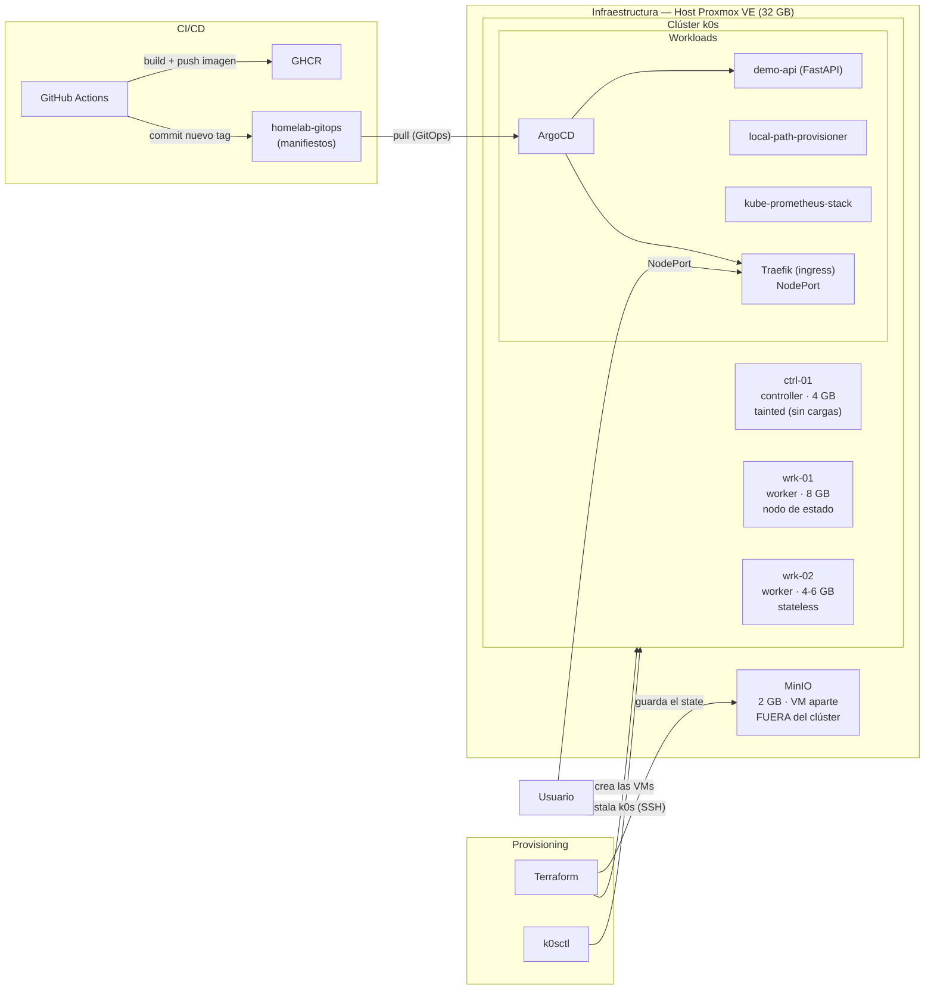

# homelab-iac

> Infraestructura del homelab como código: las VMs del clúster k0s,
> creadas y gestionadas con Terraform sobre Proxmox VE.

---

## Estado

**Fase 1 cerrada y verificada** (17/09/2026)
VMs del clúster y state remoto con locking en funcionamiento.

**Fase 2 cerrada y verificada** K0s funcionando a la perfección con traefik exponiendo y local-path-provisioner  

## Alcance

Este repositorio cubre el despliegue con IaC de las VMs para k0s, además de la configuración de MinIO como backend externo.

## Problema

Resuelve el problema de crear VMs a mano. De esta forma tenemos una infraestructura replicable desde 0 sin pasos manuales no documentados.

El state de Terraform no puede vivir dentro del clúster ni en local, ya que podría corromperse por el state locking o borrarse; por ello se utiliza MinIO como almacenamiento externo.

Se automatiza el despliegue de k0s: Terraform crea y k0sctl configura.

## Arquitectura



## Stack

| Componente | Uso |
|---|---|
| **Terraform** | Provisioning de las VMs |
| **Provider `bpg/proxmox`** | Integración con Proxmox VE |
| **k0s** | Distribución Kubernetes |
| **MinIO** | Backend remoto de state (S3 compatible) |

## Requisitos previos

- Terraform
- Proxmox

## Cómo reproducirlo

1. **En Proxmox**: crear el token API, tener una plantilla configurada y una imagen para el LXC.
2. **Desplegar MinIO**: con Terraform ya configurado para usar Proxmox, desplegar el LXC de MinIO en `bootstrap/minio`.
3. **Configurar MinIO**: entrar al LXC y ejecutar `install-minio.sh`.
4. **Preparar el backend**: desde tu PC, con `mc`, crear el bucket + usuario `terraform` + configurar policy.
5. **Aplicar**: `terraform init -backend-config=backend.tfvars` desde la raíz.
6. **k0s**: En una bash usar los comandos: 

```set -a          # activa allexport```

```source .env     # carga las variables del archivo```

```set +a          # desactiva allexport, vuelve al comportamiento normal```
# Bootstrap del clúster (post k0sctl)

> Prerrequisito: `k0sctl apply` ejecutado.

## 1. local-path-provisioner

Aplicamos el manifiesto en `bootstrap/k0s/local-path/
local-path-storage.yaml` (upstream v0.0.37, versión fijada) → crea ns,
ServiceAccount, RBAC, Deployment, su ConfigMap y su StorageClass.

    kubectl apply -f bootstrap/k0s/local-path/local-path-storage.yaml

Después aplicamos **nuestro** ConfigMap, que restringe el provisioning a
wrk-01 (el de upstream permite cualquier nodo):

    kubectl apply -f bootstrap/k0s/local-path/configmap.yaml

Y borramos la StorageClass que trae upstream, que no usamos:

    kubectl delete storageclass local-path
    # la nuestra es 'local-path-provisioner': no son la misma, no hay colisión

### Verificación
    kubectl get pods -n local-path-storage        # 1/1 Running (en wrk-02)
    kubectl get storageclass                      # solo local-path-provisioner, no default
    kubectl get cm -n local-path-storage local-path-config -o yaml   # debe apuntar a wrk-01
    # y un PVC de prueba que llegue a Bound

## 2. Traefik

(ns + repo, versión fijada, values.yaml del repo)

    helm install traefik traefik/traefik --version 41.6.0 \
      -n traefik --create-namespace -f bootstrap/k0s/traefik/values.yaml

### Verificación
    kubectl get svc -n traefik     # NodePort, 30000/30001, sin <pending>
    kubectl get pods -n traefik -o wide   # en wrk-02
    curl -I http://<ip-worker>:30000      # 404 = Traefik responde

### Acceso al dashboard (no expuesto)
    kubectl port-forward -n traefik deploy/traefik 9000:8080
    # http://localhost:9000/dashboard/
## Ficheros

| Fichero | Propósito |
|---|---|
| `versions.tf` | Versiones de Terraform y del provider |
| `providers.tf` | Configuración del provider |
| `variables.tf` | Variables de entrada |
| `main.tf` | Recursos: las VMs del clúster |
| `example.tfvars` | Valores de ejemplo (sin secretos) |
En minio
| `versions.tf` | Versiones de Terraform y del provider |
| `providers.tf` | Configuración del provider |
| `variables.tf` | Variables de entrada |
| `main.tf` | El LXC |
| `example.tfvars` | Valores de ejemplo (sin secretos) |
| `tfstate-policy` | Policy para el usuario de minio |
| `install-minio.sh` | Script para instalar minio |


## Decisiones de diseño

### SOPS + age vs Vault

Se ha decidido utilizar **SOPS + age** en lugar de Vault debido a los siguientes factores:

- **Menor complejidad operativa** y menor consumo de recursos.
- Mejor integración con un enfoque **GitOps**, permitiendo mantener los secretos cifrados junto a la configuración.
- No requiere un proceso de **unsealing** tras el reinicio de una VM.
- Menor infraestructura que mantener, al no requerir un servicio dedicado de gestión de secretos.

> **Coste asumido:** la custodia de los secretos dependerá de una única clave privada de **age**, que deberá almacenarse de forma segura y contar con un mecanismo de recuperación.

---

### k0s vs k3s

Se ha descartado **k3s** en favor de **k0s**, ya que k3s incorpora herramientas y componentes adicionales que no son necesarios para el proyecto.

El objetivo es desplegar y configurar estos componentes de forma independiente, manteniendo un mayor control sobre la infraestructura y evitando depender de funcionalidades preinstaladas que no se utilizarán.

---

### Local Path vs Longhorn

Se ha decidido utilizar **Local Path** en lugar de **Longhorn** debido a que el proyecto no maneja datos críticos y el clúster contará únicamente con **2 workers**.

Con esta configuración, la replicación proporcionada por Longhorn no aporta una alta disponibilidad completa para los workloads, ya que la pérdida de un nodo reduciría significativamente la capacidad disponible del clúster.

Además, Local Path presenta una menor complejidad y consumo de recursos, lo que encaja mejor con las necesidades actuales del proyecto.

> **Coste asumido:** los workloads con estado, como **ArgoCD y Prometheus**, se configurarán explícitamente para ejecutarse siempre en el mismo nodo. En caso de pérdida de dicho nodo, estos workloads dejarán de estar disponibles hasta su recuperación.

## Evidencia

```
$ terraform apply
Apply complete! Resources: 3 added, 0 changed, 0 destroyed.

$ terraform plan
proxmox_virtual_environment_vm.vm["wrk-02"]: Refreshing state... [id=x]
proxmox_virtual_environment_vm.vm["ctrl-01"]: Refreshing state... [id=x]
proxmox_virtual_environment_vm.vm["wrk-01"]: Refreshing state... [id=x]

No changes. Your infrastructure matches the configuration.
```

## Limitaciones conocidas

1. Binario `DEVELOPMENT.GOGET` → sin release ni SHA256 verificable: la reproducibilidad del runtime no está garantizada.
2. State sin cifrar en reposo, y viaja por HTTP en la LAN.
3. Bucket y usuario se crean a mano con `mc`: si se pierden, el state queda inaccesible. No hay backup automatizado todavía.
4. Se entra como root al contenedor (en LXC no hay user_account real como en VM).

## Qué haría distinto / siguiente paso

- Extraer el patrón de VM a un módulo reutilizable (hoy está inline).
- Versionar el binario de MinIO desde una release publicada.
- Automatizar el `mc mirror` del state.
- Meter el token en un fichero aparte del `.tfvars`.